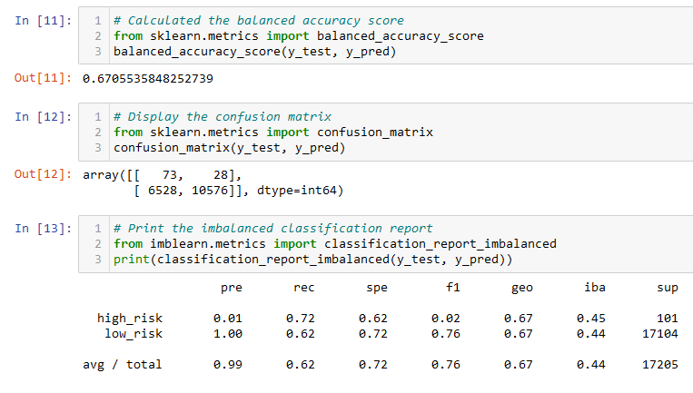
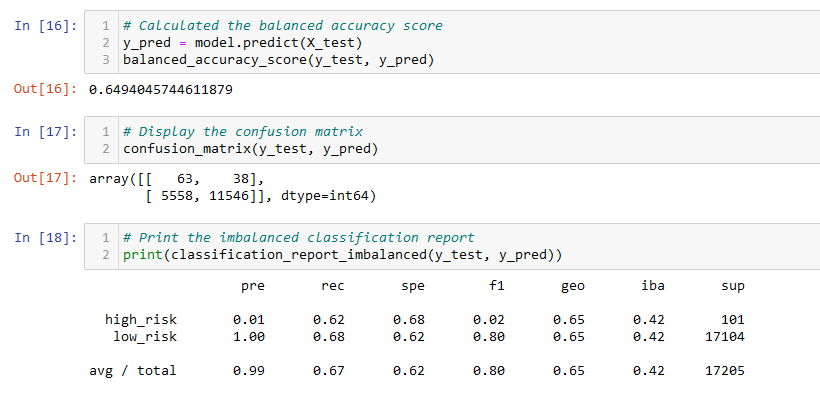
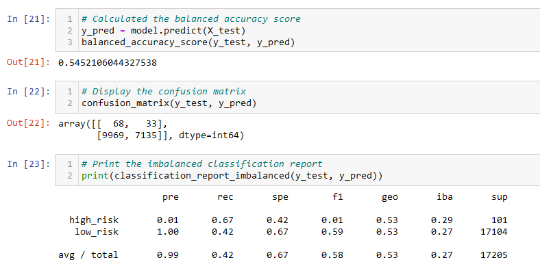
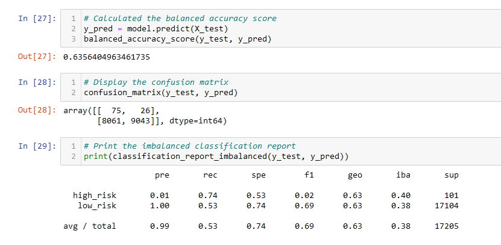
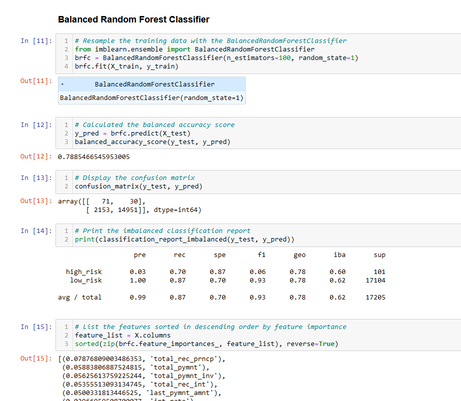
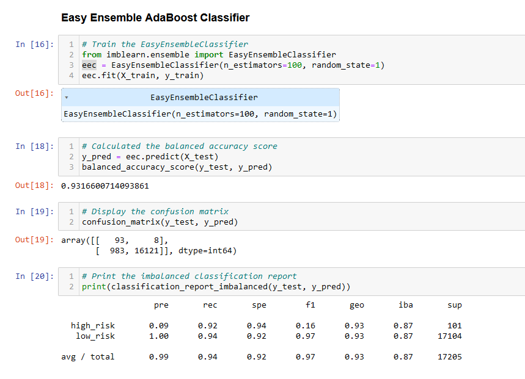

# Credit_Risk_Analysis

## <u>Credit_Risk_Analysis:</u>
### Jill has asked us to evaluate and predict credit risk. Since credit risk is an inherently unbalanced classification problem, we will need to see how different algorithms perform and determine which one is the best at predicting credit risk. The credit card credit dataset Jill wants us to use is from LendingClub, a peer-to-peer lending services company.
 

## <u>Results:</u>
 

## 1. Naive Random Oversampling

### As can be seen in the picture above the had a balanced accuracy score of 67%. For low-risk the algorithm had very high precision, as opposed to high-risk with only 1% precision. In terms of sensitivity low-risk was less than high risk.
 

 ## 2. SMOTE Oversampling

  

 ### The Synthetic Minority Oversampling machine learning model did not differ by much from the previous algorithm in terms of accuracy and precision. Accuracy being 65% and precision for high-risk being 1%. However, with this model the sensitivity for low-risk was higher than before and lower for high-risk loans.
 

 ## 3. Undersampling
 
 

### The accuracy of this algorithm was worse than the previous two with only 54% accuracy. Precision remained the same. The major difference was the sensitivity score for the low-risk loans being only 42%.
 

 ## 4. Combining both Undersampling with Oversampling with SMOTEENN algorithm
 
 

### Having an accuracy score of 63% and the same precision as the Oversampling methods. This algorithm seems to perform better than the Undersampling method. Although this algorithm has the highest sensitivity score of 74% for high-risk so far, its low-risk score of 53% is lower than the Oversampling sensitivity methods.
 

 ## 5. Balanced Random Forest Classifier
 
 

### The accuracy score is 78%. Precision score is still low but has increased to 3% for high-risk compared to the other algorithms. Sensitivity score is high with 70% for high-risk and 87% for low-risk.
 

 ## 6. Easy Ensemble AdaBoost Classifier
 
 

### This algorithm seems to have performed the best so far. Accuracy of 93%, prediction score of 9% for high-risk, and the sensitivity is in the 90% range for low and high-risk.
 

## <u>Summary:</u>

- ### As can be seen from the above models, precision for high-risk had the lowest score in all our machine learning models. However, the sensitivity score(recall) seemed to be above 50% in most cases for low and high-risk loans. Having a high sensitivity rate means that the machine learning model correctly accessed most of the high-risk and low-risk loans. The last model, Easy Ensemble Classifier, was able to have a recall score of 92% high-risk and 94% low-risk. Across all models, precision for low-risk was 100%. This is important, since LendingClub needs to know how likely the loan is low-risk.

- ### All in all, I would recommend using the Easy Ensemble AdaBoost Classifier, as the preferred machine learning model. It would be better if the precision value would be higher for high-risk, however, the high recall value makes up for it. Furthermore, Easy Ensemble Classifier also has an accuracy score of 93%, which is the highest score out of all the machine learning models. Although this may lead to more false-positives, it is better to detect high-risk loans, than completely missing them and therefore incurring cost for the company.

